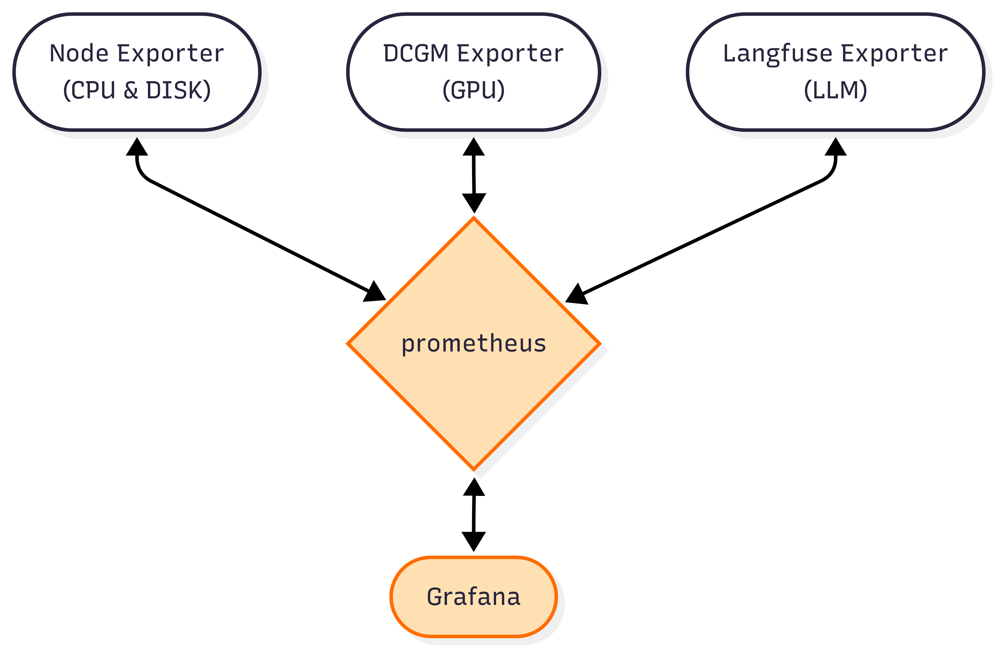

# Sentinel

이 프로젝트는 [Prometheus](https://prometheus.io/)와 [Grafana](https://grafana.com/)를 사용하여 시스템 및 애플리케이션 메트릭을 모니터링하고 시각화하는 대시보드 시스템입니다.

## 아키텍처
- Prometheus + Grafana

<p align="center">
  
</p>


## 선행 조건 (Prerequisites)

**중요:** 이 프로젝트를 실행하기 전에, 의존성이 있는 선행 프로젝트가 반드시 실행 중이어야 합니다. 이 프로젝트는 선행 프로젝트와 동일한 외부 Docker 네트워크에 연결되어야 정상적으로 작동합니다.

### 필요 소프트웨어

*   [Docker](https://www.docker.com/get-started)
*   [Docker Compose](https://docs.docker.com/compose/install/)

## 시작하기 (Getting Started)

1.  **리포지토리 클론**
    ```bash
    git clone https://github.com/Roflaff/Sentinel.git
    cd Sentinel
    ```

2.  **환경 변수 설정**
    프로젝트 루트 디렉터리에 `.env` 파일을 생성하고, `docker-compose.yml`에서 사용할 외부 네트워크 이름을 지정합니다.

    - find network name:

    ```bash
    docker network ls
    NETWORK ID     NAME                                        DRIVER    SCOPE
    ...
    ```
    
    - `.env`:
    ```
    EXTERNAL_NETWORK_NAME=your_external_network_name
    ```
    `your_external_network_name`을 선행 프로젝트에서 사용하는 네트워크 이름으로 변경해주세요.

3.  **프로젝트 실행**
    아래 명령어를 사용하여 Docker Compose로 프로젝트를 시작합니다.
    ```bash
    docker-compose up -d
    ```

## 서비스 접속

*   **Prometheus**
    *   URL: [http://localhost:19090](http://localhost:19090)
    *   Prometheus 대시보드 및 메트릭 수집 상태를 확인할 수 있습니다.

*   **Grafana -> MAIN**
    *   URL: [http://localhost:13030](http://localhost:13030)
    *   초기 로그인 정보:
        *   Username: `admin`
        *   Password: `admin`
    *   로그인 후 비밀번호를 변경하는 것을 권장합니다.
    *   데이터 불러오기 확인 및 대시보드 설정은 다음 링크를 참고합니다.
    *   Ref: TODO:

## 설정 (Configuration)

### Prometheus 타겟 설정

Prometheus가 수집할 메트릭 소스(타겟)를 변경하려면 `conf/prometheus.yml` 파일을 수정하세요. 해당 네트워크에서 실행되고 있는 포트에 접근합니다.

```yaml
scrape_configs:
  - job_name: node-exporter
    metrics_path: /metrics
    static_configs:
      - targets: ['node-exporter:9090']
  
  # 여기에 새로운 타겟을 추가할 수 있습니다.
  # - job_name: 'my-app'
  #   static_configs:
  #   metrics_path: /metrics
  #     - targets: ['host.docker.internal:8080']
```

설정 변경 후에는 아래 명령어로 서비스를 재시작해야 합니다.
```bash
docker-compose restart prometheus
```

## 기여하기 (Contributing)

이 프로젝트에 기여하고 싶으시다면, `.github` 디렉터리에 있는 `ISSUE_TEMPLATE`과 `pull_request_template.md`를 참고하여 이슈를 생성하거나 풀 리퀘스트를 보내주세요.